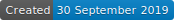
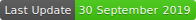
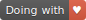

# Score Keeper in Vanilla JS

  

A Score Keeper created only with Vanilla JS (Zero library)

## To start

Nothing needed to start, only download this repository or open it with the link in the description !

### Prerequisites

If you want to edit it, you need beforehand a code editor like Visual Studio Code, Sublime Text, Atom, ...

### Delivery conditions

#### Base

* 2 separate counters (Player 1 and Player 2)
* 3 Buttons (Player 1 + Player 2 + Reset)
* Each click increments by 1 the corresponding score
* Reach the max score => Score in Green & Lock everything except the Reset
* Input set the max score (5 by default)
* Reset to default value
* Vanilla JS only (Zero library or C/C)

#### Bonus

* A beautiful page
* Dark mode

[PDF of the delivery conditions (in French)](https://github.com/yes-we-web/livraisonsolo/blob/master/livraison-solo-05.pdf)

## Made with

* [Visual Studio Code](https://code.visualstudio.com) - Code Editor

## Auteurs

* **Dylan Vienne** _alias_ [@sinhast](https://github.com/sinhast?tab=repositories)

## License

No License applied to this project.
